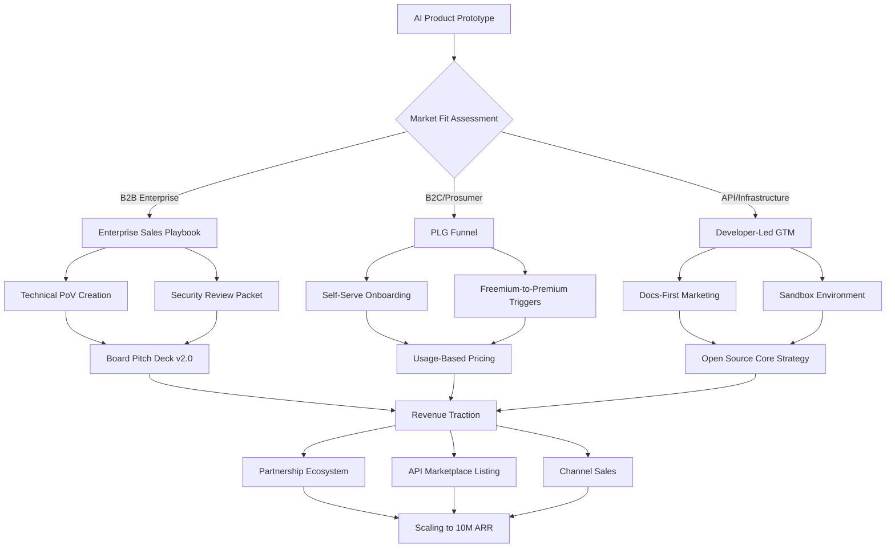

# AI GTM Navigator: The Technical Founder's Go-to-Market Playbook for AI Products in 2026

[](https://gilvangonzalez.github.io/technical-founding-gtm-toolkit/)

**Your strategic command center for launching, positioning, and scaling AI-native products.** This repository is not a checklist; it is a decision engine for technical founders who refuse to let brilliant code die in obscurity.

---

## Why This Exists

You built a model that can predict protein folding, automate legal discovery, or generate photorealistic synthetic data. But the market does not care about your transformer architecture. It cares about **value**, **trust**, and **velocity**.

This repository bridges the chasm between a working prototype and a revenue-generating product. It is inspired by the brutal lessons from dozens of AI startups that either achieved escape velocity or imploded from GTM neglect. Think of it as a **strategic flight deck** for your AI company—you will find the dials, gauges, and emergency procedures here.

---

## Mermaid Diagram: The AI GTM Decision Engine



This is not a linear path. You will loop. You will pivot. But you will always know which lever to pull.

---

## Core Components

### 1. Positioning for AI Products
- **The GPU-to-Value Translation**: How to explain your model's superiority in business terms (e.g., "40% lower hallucination rate" vs. "5x attention head depth")
- **Competitive Thermal Map**: A framework to plot your product against existing solutions on axes of cost, latency, accuracy, and privacy
- **Messaging Matrix**: One-liners for investors, CTOs, compliance officers, and end-users (they speak different languages)

### 2. Pricing Strategies for Technical Products
- **Input-Based Pricing Calculator**: Token cost vs. user willingness-to-pay algorithm
- **The Value Metric Vault**: How to tie pricing to outcomes (e.g., "per automated report" not "per API call")
- **Freemium Friction Points**: Where to gate features to maximize conversion without killing virality

### 3. Partnership Ecosystem Blueprints
- **Platform Integrations**: How to get featured on AWS Marketplace, Azure AI Gallery, or Hugging Face Hub
- **Consultancy Partnerships**: When to white-label your API for system integrators
- **Data Partnership Agreements**: Template for shared model training without violating IP

### 4. Enterprise Sales for AI Founders
- **The 90-Day Security Audit Survival Kit**: SOC 2, HIPAA, GDPR evidence packets
- **Technical PoV Playbook**: How to run a proof-of-value that ends in a PO, not a "we'll get back to you"
- **Deal Desk Cheat Sheet**: Discount authority, legal change orders, and procurement psychology

### 5. Product-Led Growth (PLG) for AI
- **The First-Interaction Hook**: Onboarding that demonstrates value in under 60 seconds
- **Virality Loops for AI Products**: Embedding that encourages users to share results (e.g., "Generated by [Your AI]")
- **Usage-to-Conversion Dashboard**: Tracking the magic moment when a user goes from curious to committed

### 6. AI-Specific GTM Tactics
- **Model Distillation as Marketing**: Release a smaller, open-source version of your model to build community
- **Benchmarking as Positioning**: How to steer the narrative around benchmark results (choose your axis)
- **LLM App Store Optimization**: Categorizing your product for AI-native search tools

### 7. Board Communication & Fundraising
- **The AI Founder's Board Deck**: Slide structure for non-technical board members
- **Metropolitan vs. Frontier Metrics**: What VCs actually look for in AI startups (hint: it is not just top-line revenue)
- **The Bridge Financing Narrative**: How to frame a pivot in AI strategy without losing investor confidence

---

## Example Profile Configuration

This is a sample configuration for a hypothetical AI startup, `NovaQuery`—a retrieval-augmented generation (RAG) engine for legal firms.

```yaml
startup:
  name: NovaQuery
  product_type: RAG-powered legal research
  primary_user: Corporate lawyer
  pricing_model: 
    tier_1: "Per-search (0.05 cents/query)"
    tier_2: "Seat-based ($150/user/mo)"
    tier_3: "Enterprise flat fee ($15k/mo)"
  gtm_channels:
    - Legal tech conference sponsorships
    - Law firm CIO direct outreach
    - Clio Integration Marketplace listing
  target_metrics:
    - Time-to-first-value: < 3 minutes
    - Net dollar retention: > 120%
    - Security certification timeline: HIPAA by Q2 2026
  partnership_targets:
    - Westlaw (data access)
    - Clio (integration)
    - Local bar associations (aftersales distribution)
```

---

## Example Console Invocation

This script simulates the GTM analysis dashboard for a new AI product.

```
$ python analyze_gtm.py --product "SyntheticDataGen-v2" --target_market "Healthcare AI developers" --budget "$200k"

RESULTS:

Market Fit Score: 78 / 100
Top Channel: Developer documentation + PyPI listing
Pricing Recommendation: Usage-based at $0.003 per row, first 10k rows free
Enterprise Friction Points:
  - HIPAA compliance packet missing
  - No representative on Hugging Face
  - Pricing not visible in documentation
Priority Actions:
  1. Draft SOC 2 report (due 60 days)
  2. Create sample notebooks for medical imaging use case
  3. Reach out to 3 healthcare AI accelerators
```

---

## Emoji OS Compatibility Table

| Operating System | AI GTM Tool Compatibility | Emoji Rendering | Notes |
|-----------------|---------------------------|-----------------|-------|
| macOS Sequoia  | Full (Python scripts + dashboards) | ✅ Native | Recommended for development |
| Windows 11     | Partial (PowerShell wrappers needed) | ✅ Native | Some bash scripts require WSL |
| Linux (Ubuntu 24.04)| Full (native bash + cron jobs) | ✅ Terminal via wsl | Best for CI/CD GTM automation |
| iOS/iPadOS 18  | Viewer only (no scripts) | ✅ Native | Use for board deck reviews |
| Android 15     | Viewer only (no scripts) | ✅ Native | Limited for operational use |
| ChromeOS       | Partial (Linux container mode) | ✅ Native | Requires advanced setup |

---

## Feature List

- **Responsive UI for Strategy Canvas** – A web-based dashboard that adapts to mobile, tablet, and desk setups for reviewing GTM hypotheses on the go
- **Multilingual Market Entry Pack** – Templates and messaging frameworks localized for EN, ZH, JA, DE, FR, ES, and PT-BR markets
- **24/7 Community Support via AI Agent** – A specialized RAG bot (built on your own tech) trained on all `.md` files in this repo to answer founder questions instantly
- **Automated Competitor Intel** – Scripts that scrape pricing pages and product docs of competing AI tools and generate a weekly summary
- **Pricing Model Simulator** – Run Monte Carlo simulations on different pricing tiers to predict revenue under various adoption scenarios
- **Legal & Compliance Doc Generator** – Auto-generate SOC 2 evidence mapping, GDPR data flow maps, and privacy policy drafts
- **Board Deck Builder** – A Jupyter notebook that turns your product metrics into investor-ready slide content with narrative framing

---

## Integration: OpenAI API & Claude API

This repository includes Python scripts that leverage both APIs to accelerate your GTM work:

**OpenAI API Integration**
- Use GPT-4o to analyze customer support tickets and categorize pain points by frequency
- Generate competitive analysis summaries from scraped web content
- Draft personalized outreach emails for enterprise leads based on LinkedIn profiles

**Claude API Integration**
- Use Claude 3 Opus for long-form content creation: white papers, case studies, and technical blog posts
- Conduct sentiment analysis on user feedback from App Store reviews
- Summarize earnings calls of potential enterprise customers to identify AI buying signals

```python
# Example snippet from gtm_analyzer.py
import openai
import anthropic

def generate_competitor_brief(competitor_url):
    # Scrape page content
    content = scrape_url(competitor_url)
    
    # Use OpenAI for structural analysis
    response = openai.chat.completions.create(
        model="gpt-4o",
        messages=[{
            "role": "system",
            "content": "Extract the pricing, target customer, and unique value proposition from this AI product page."
        }, {
            "role": "user",
            "content": content
        }]
    )
    return response.choices[0].message.content
```

---

## Getting Started

1. **Clone the repository** to your local machine
2. **Install dependencies**: `pip install -r requirements.txt` (includes openai, anthropic, pandas, streamlit)
3. **Set your API keys** in a `.env` file (template provided)
4. **Run the diagnostic tool**: `python gtm_diagnostic.py --product-name "Your AI Product"` to generate your initial GTM scorecard
5. **Explore the playbooks** in the `/playbooks/` directory for strategic deep dives

[](https://gilvangonzalez.github.io/technical-founding-gtm-toolkit/)

---

## Disclaimer

This repository provides frameworks, templates, and strategic guidance for go-to-market activities related to AI products. The examples, scripts, and configurations are for educational and reference purposes. They do not constitute legal, financial, or business advice. Always consult with qualified professionals—commercial lawyers, tax advisors, and industry-specific consultants—before finalizing pricing, contracts, or partnership agreements. The creators of this repository are not liable for any losses, missed opportunities, or regulatory penalties incurred through the use of these materials. Market conditions, AI regulations, and platform policies change rapidly; validate all assumptions against current data.

---

## License

This project is licensed under the MIT License – see the full text for details:

[MIT License](LICENSE)

You are free to use, modify, and distribute this framework for commercial and non-commercial purposes. Attribution is appreciated but not required.

---

*Built for the founders who understand that a great model is a starting line, not a finish line. Launch fast, iterate faster, and never let technical complexity become an excuse for market silence.*